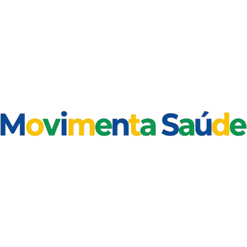
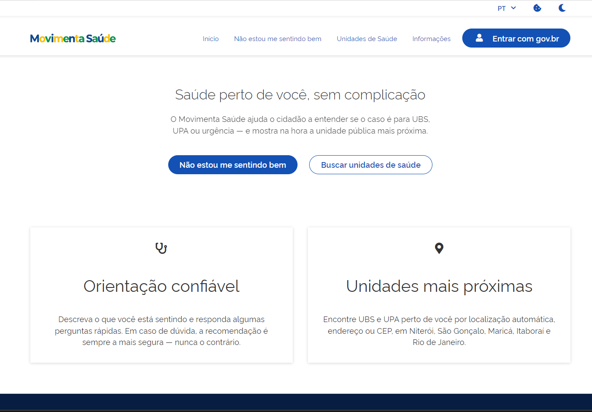
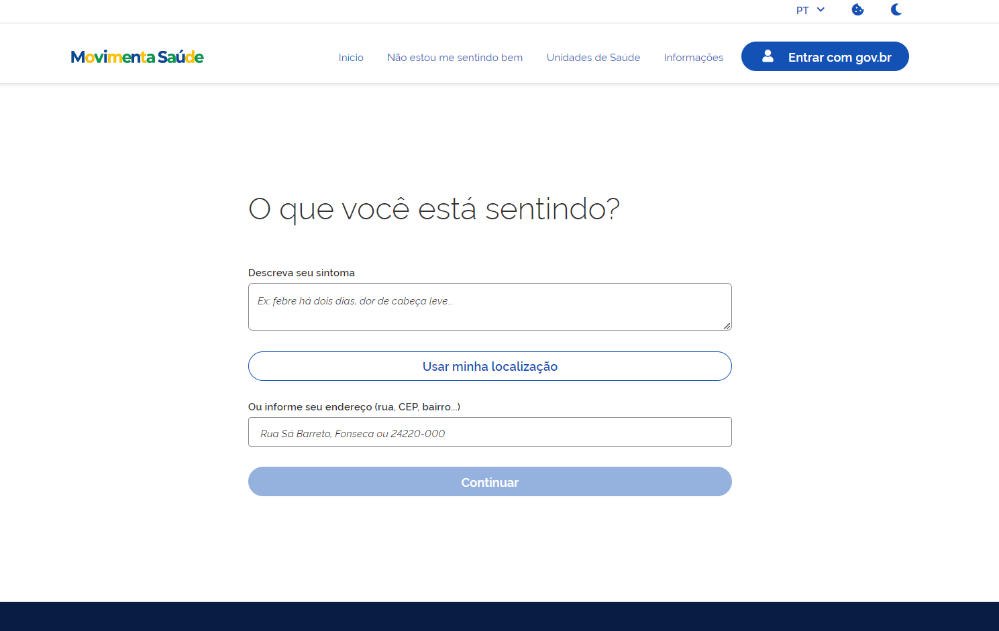
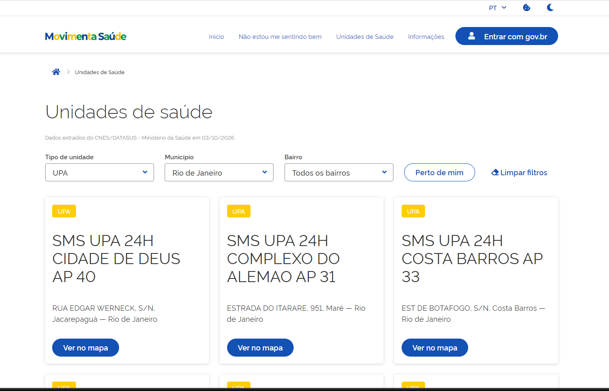
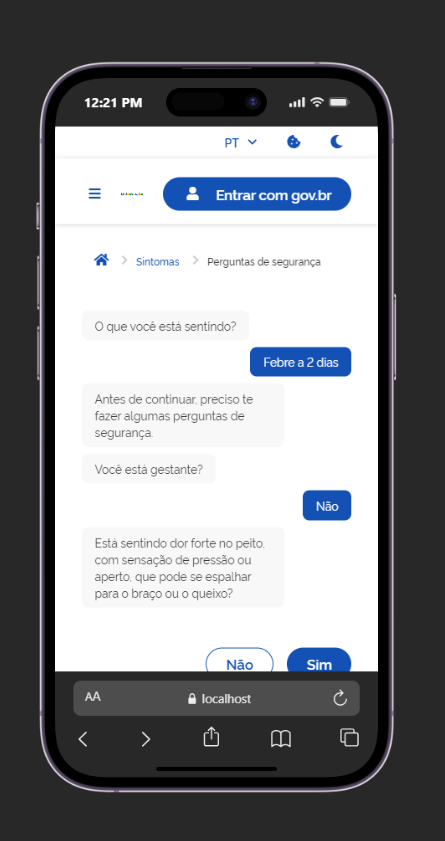
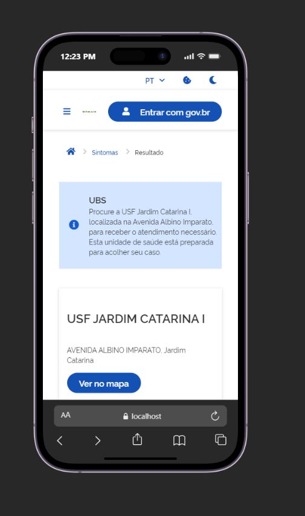

  

# Movimenta Saúde

Orientação de saúde para o cidadão: diante de um sintoma, o projeto responde se o caminho certo é uma **UBS** (unidade básica), uma **UPA** (pronto atendimento) ou uma **urgência real (192/SAMU)** — e mostra a unidade mais próxima que atende aquele caso.

> Código-fonte privado. Este repositório documenta o problema, os dados e as fontes oficiais usadas; uma demonstração do produto funcionando é feita diretamente para quem avalia o projeto (recrutadores, prefeituras, gestores de saúde).

## O problema

O Brasil tem uma rede de saúde em camadas (UBS → UPA → hospital/urgência), mas a população frequentemente não sabe qual delas procurar — e isso tem custo real, tanto em superlotação de pronto-socorro quanto em gente que deveria ter ido a uma emergência e foi a uma UBS fechada, ou vice-versa.

- Na rede estadual do Rio de Janeiro, as 27 UPAs registraram **mais de 2,7 milhões de atendimentos** só entre janeiro e novembro de 2025. UPAs isoladas como Mesquita e Santa Cruz passaram de 139 mil atendimentos no mesmo período. ([rj.gov.br](https://www.rj.gov.br/saude/node/3774))
- Estudos sobre uso de pronto atendimento no Brasil mostram que boa parte da demanda é de **condições sensíveis à atenção básica** — ou seja, casos que uma UBS resolveria, mas que acabam goela abaixo da UPA/PS porque a UBS está fechada ou o paciente não sabe que deveria ter ido lá primeiro. Em um estudo (SciELO), 51% dos atendimentos de pronto-socorro eram CSAP (condições sensíveis à atenção primária), e 62,8% ocorreram fora do horário da UBS. ([scielo.br](http://www.scielo.br/j/csc/a/g49hxmjshxxjQKLWrCJgR9D/?lang=pt))
- O próprio Ministério da Saúde reconhece o problema a ponto de publicar material de orientação pública explicando a diferença entre UBS e UPA. ([gov.br/saude](https://www.gov.br/saude/pt-br/assuntos/noticias/2025/outubro/ubs-ou-upa-saiba-quando-procurar-a-unidade-mais-proxima-de-voce))
- O SUS é universal por garantia constitucional (Art. 196) — inclusive para estrangeiros, documentados ou não. Isso também é fluxo: o Brasil recebeu **194.331 novos migrantes em 2024** ([Agência Brasil](https://agenciabrasil.ebc.com.br/direitos-humanos/noticia/2025-02/brasil-recebeu-194331-migrantes-em-2024)), e mais de 500 mil migrantes foram cadastrados na atenção básica entre 2013 e 2023 segundo o Sisab — população que, além das barreiras de todo paciente, frequentemente desconhece por completo como a rede brasileira é organizada.

Movimenta Saúde ataca a parte do problema que é puramente informacional: dado um sintoma e uma localização, decidir de forma **determinística e auditável** qual nível de atenção procurar, e apontar a unidade certa mais próxima — sem depender de o cidadão já saber a diferença entre UBS e UPA.

Vale dizer: a ideia não é nova. O próprio app **Meu SUS Digital**, do Ministério da Saúde, já tem uma funcionalidade parecida de localizar unidades de saúde — mas é pouco divulgada e, na prática, difícil de achar e de usar dentro do app. O Movimenta Saúde não tenta substituir o Meu SUS Digital; tenta ser a porta de entrada simples que esse tipo de funcionalidade ainda não teve.

## Telas

   
  Tela inicial

   
  Início da triagem — o cidadão descreve o sintoma em texto livre

   
  Busca de unidades por tipo, município e bairro, com link direto para localização no mapa

  
  &nbsp;&nbsp;
   
  Fluxo completo também em mobile: triagem em formato de chat e resultado com a unidade indicada

## Acolhimento a quem não fala português

Boa parte dos estrangeiros no Brasil desconhece como a rede de saúde funciona — e muitos sequer leem português fluentemente. Por isso a interface tem **tradução completa para inglês** (textos de navegação, triagem e resultado — nunca os dados em si, como nomes e endereços de unidades, que continuam em português por serem dado real, não conteúdo de interface). Cada unidade indicada também abre direto no **Google Maps** a partir do endereço cadastrado, então a barreira de idioma não impede a pessoa de efetivamente chegar lá.

## Confiabilidade dos dados

Um dos maiores focos do projeto é tornar a base de unidades mais confiável. O CNES (cadastro oficial) tem inconsistências conhecidas — endereços desatualizados, duplicidade, unidades desativadas ainda listadas. Por isso o pipeline de dados também busca o **CNPJ de cada unidade** e cruza essa informação com outras fontes públicas, como uma segunda checagem (double-check) antes de considerar um dado confiável o bastante para orientar alguém.

## Como o projeto decide (sem ser uma IA decidindo sozinha)

Ponto central do design: um modelo de linguagem nunca decide o destino clínico. A LLM só serve para transformar a fala livre do usuário ("tô com uma dor de barriga chata há 2 dias") em campos estruturados (sintoma, intensidade, sinais de alerta). A decisão final — UBS, UPA ou 192 — é sempre de um **motor de regras determinístico**, onde cada regra:

- tem uma **fonte oficial citada** (Ministério da Saúde, protocolos municipais de classificação de risco, hospitais de referência);
- carrega um status de revisão (`pendente_revisao` até validação por profissional de saúde).

Essa separação (extração de linguagem natural vs. decisão clínica) é o motivo de o código ficar fechado por enquanto: parte do projeto envolve integração em andamento com autenticação gov.br, e a proposta já foi levada a prefeituras e à esfera estadual/federal — o código será aberto quando essa conversa avançar.

## Dados e fontes públicas usadas

Piloto cobrindo 5 municípios da região metropolitana do Rio de Janeiro: Niterói (330330), São Gonçalo (330490), Maricá (330270), Itaboraí (330190) e Rio de Janeiro (330455).

**Cadastro das unidades de saúde (UBS/UPA, endereço, geolocalização):**
- CNES — Cadastro Nacional de Estabelecimentos de Saúde, Ministério da Saúde/DATASUS — [dadosabertos.saude.gov.br](https://dadosabertos.saude.gov.br/dataset/cnes-cadastro-nacional-de-estabelecimentos-de-saude)
- API de Dados Abertos do Ministério da Saúde (DEMAS) — [apidadosabertos.saude.gov.br](https://apidadosabertos.saude.gov.br/v1/#/CNES/get_cnes_estabelecimentos)

**Regras clínicas (toda regra do motor de decisão cita uma destas fontes):**
- Caderno de Atenção Básica nº 28 (vol. 2), Ministério da Saúde — [bvsms.saude.gov.br](https://bvsms.saude.gov.br/bvs/publicacoes/acolhimento_demanda_espontanea_queixas_comuns_cab28v2.pdf)
- Protocolo de Acolhimento com Classificação de Risco (baseado na Portaria GM/MS nº 2.048/2002)
- "Quando ir ao pronto-socorro?", Hospital Israelita Albert Einstein — [einstein.br](https://www.einstein.br/n/vida-saudavel/quando-ir-ao-pronto-socorro-saiba-as-situacoes-que-realmente-exigem-pronto-atendimento)
- "Saiba quando procurar uma UPA", Prefeitura de São Paulo — [prefeitura.sp.gov.br](https://prefeitura.sp.gov.br/w/saiba-quando-procurar-uma-unidade-de-pronto-atendimento)
- Secretaria de Saúde de Niterói — [saude.niteroi.rj.gov.br](https://saude.niteroi.rj.gov.br/servicos/)

O arquivo completo com cada fonte, trecho citado, nível de confiabilidade e status de revisão clínica está versionado em `data/sources/sources.json` (público, faz parte do que o `.gitignore` deixa passar).

## Stack

FastAPI + PostgreSQL/PostGIS no backend, Next.js no frontend seguindo 100% o [gov.br Design System](https://www.gov.br/ds/), LLM apenas como extrator de dados estruturados (nunca como decisor clínico).

## Em resumo

O Movimenta Saúde quer melhorar o fluxo de atendimento da rede pública e ajudar a população — brasileira ou não — a encontrar o atendimento adequado para o seu caso, sem depender de já conhecer como o sistema de saúde é organizado.

## Contato

Interessado em ver o produto funcionando ou discutir uma parceria com sua prefeitura/secretaria de saúde? Entre em contato.
